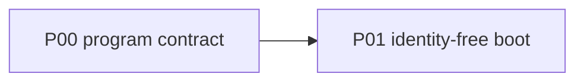

# P00 — Program contract

| Field | Value |
|---|---|
| Status | done |
| Owner | fork |
| Depends on | — |
| Unlocks | P01 |
| Primary crates | docs only |

## Neighborhood

Full DAG: [dag.md](dag.md).

## Goal

Write down the fork envelope so later phases do not renegotiate keep vs cut
in the middle of a diff. This phase is documentation, not code.

## Capabilities

- Root [`AGENTS.md`](../AGENTS.md) is the working project rule file.
- [`MEMORY.grok.md`](../MEMORY.grok.md) records decisions and session history.
- This `phases/` directory is the capability DAG and EDD set.
- Implementers know: keep product surface, keep all tool families, revise
  only auth + models for local/LAN runtimes.

## Non-goals

- No code changes.
- No crate deletions.
- No rename of the binary (still `xai-grok-pager` in-tree).

## Seams

| Path | Change |
|---|---|
| `AGENTS.md` | North star, seams, first-slice done criteria |
| `MEMORY.grok.md` | Decision log |
| `phases/` | EDDs + dependency index |

## Acceptance

- [x] `AGENTS.md` exists at repo root and matches the keep/revise split.
- [x] `MEMORY.grok.md` exists and captures orientation + envelope.
- [x] `phases/README.md` lists every phase with depends-on edges.

## Risks

- Docs drift from code — update phase status and memory when a slice lands.

## Notes

Completed 2026-08-12 in the orientation session. Source extract
`SOURCE_REV` = `5d08d7e4123092567ccd584cd9f99afa2972065c`.
