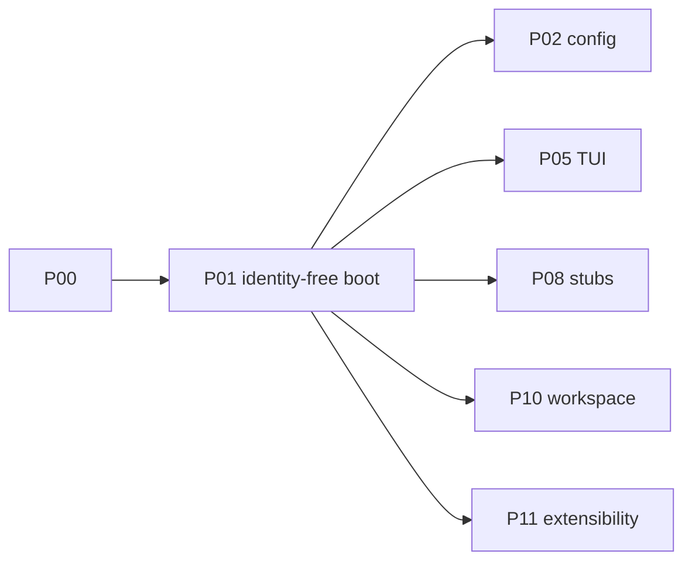

# P01 — Identity-free boot

| Field | Value |
|---|---|
| Status | done |
| Owner | — |
| Depends on | P00 |
| Unlocks | P02, P05, P08, P10, P11 |
| Primary crates | `xai-grok-pager-bin`, `xai-grok-shell`, `xai-grok-auth`, `xai-grok-update` |

## Neighborhood

Full DAG: [dag.md](dag.md).

## Goal

The binary starts without `grok login`, browser OIDC, or a required
`XAI_API_KEY`. Hosted identity is not the happy path. Subscription checks,
auto-update-from-xAI, and login-on-boot must not block a local session.

## Capabilities

- Launch TUI or headless with no xAI account.
- `grok login` against `accounts.x.ai` is unused or clearly non-default.
- Version-policy / auto-update does not exit the process for this fork.
- Auth types remain in-tree (retargeted); no wholesale crate delete.

## Non-goals

- Do not invent a new auth crate.
- Do not implement multi-runtime probing (P02 / P04 / P07).
- Do not change sampling URLs yet (P03).
- Do not remove Mixpanel crates; gate later in P08.

## Seams

| Path | Change |
|---|---|
| `xai-grok-pager-bin/src/main.rs` | Skip login-on-boot; do not hard-fail update/policy |
| `xai-grok-shell/src/auth/` | Local/no-op credential path; stop requiring session tokens |
| `xai-grok-auth` | Allow empty or env-only credentials |
| `xai-grok-update` | Disable or no-op |
| `xai-grok-shell/src/agent/subscription_check.rs` | Must not block boot |

## Acceptance

- [x] Unpinned no-cred `build_auth_methods` advertises `local` first;
      pager `startup_auth_metadata` does not require interactive login.
- [x] `enforce_version_policy_or_exit` does not exit; auto-update checks
      are disabled (`should_check_for_updates` always false).
- [x] `cargo run -p xai-grok-pager-bin -- --version` and `models` work
      with empty `GROK_HOME` and no `XAI_API_KEY` (no browser).
- [x] Headless `-p` does **not** demand `grok login`. It still 401s on
      hosted `grok-4.5` / Responses — that is P02/P03.
- [x] Auth method unit tests retargeted (24 passed). Pager
      `startup_auth_*` (8 passed).

TUI first paint was not exercised in this environment (no interactive
terminal). The same `needs_login` predicate drives welcome vs auto-Login.

## Risks

- Hidden hard dependencies (managed config, remote settings) still phone
  home — search for `accounts.x.ai`, `grok.com`, `XAI_API_KEY` required
  paths and list leftovers in this EDD's notes.

## Notes

Landed 2026-08-12.

- New ACP method `local` (`AuthMethodKind::Local`). Unpinned, no key, no
  session → first advertised method + default. `grok.com` remains later
  so `grok login` still exists.
- `authenticate("local")` succeeds with no network.
- `method_id_after_cached_token_unavailable` falls to `local`, not
  `grok.com`.
- Version policy: log-only. Auto-update: never on boot.
- One-line `use base64::Engine` in
  `acp_session_tests/tool_layer_images_bridge_tests.rs` so `--lib` tests
  compile (pre-existing).

Leftovers (not P01):

- Baked default is still hosted `grok-4.5` + `/v1/responses` (P02/P03).
- `grok models` prints "You are not authenticated" then lists models.
- Remote session restore can still call
  `ensure_authenticated_or_noninteractive` (P08/P12).
- Sentry/telemetry still init (P08).
- Subscription check code remains unused unless a gate is imposed.
