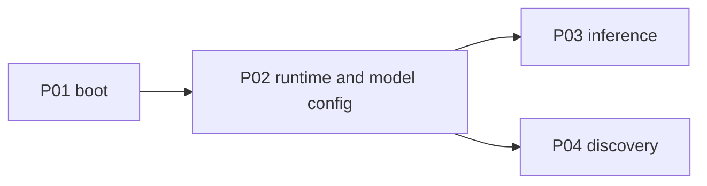

# P02 — Runtime and model config

| Field | Value |
|---|---|
| Status | done |
| Owner | — |
| Depends on | P01 |
| Unlocks | P03, P04 |
| Primary crates | `xai-grok-config`, `xai-grok-config-types`, `xai-grok-models`, `xai-grok-shell` |

## Neighborhood

Full DAG: [dag.md](dag.md).

## Goal

Operators describe local/LAN inference servers in config. Baked defaults
stop pointing at hosted `grok-4.5` + Responses. Reuse `[model.*]` and
`[model_providers.*]`; do not invent a parallel language unless those
tables cannot express a runtime.

## Capabilities

- `[model_providers.<id>]` (or equivalent) holds: id, display name,
  `base_url`, `api_backend`, optional key / `env_key`, extra headers,
  query params, context-window default.
- `[model.<name>]` still overrides a single model and can point at a
  provider/runtime.
- Credential order: model `api_key` → model/runtime `env_key` → runtime
  key → `LOCAL_API_KEY` / empty. No grok.com session-token fallback.
- `default_models.json` ships a local-shaped default (`chat_completions`,
  placeholder or documented local id), not the hosted catalog.

## Non-goals

- Do not fetch `/v1/models` yet (P04).
- Do not add per-vendor probe quirks (P07).
- Do not change TUI copy yet (P05).

## Seams

| Path | Change |
|---|---|
| `xai-grok-models/default_models.json` | Replace hosted Grok catalog |
| `xai-grok-models/src/lib.rs` | Defaults still load from that JSON |
| `xai-grok-shell/src/agent/model_providers.rs` | Runtime table + auth warnings |
| `xai-grok-shell/src/agent/config.rs` | Resolution without remote settings |
| `xai-grok-config*` | Keep existing keys; document local meaning |

## Acceptance

- [x] Baked catalog is `local` / `chat_completions` / context 8192 /
      `http://127.0.0.1:11434/v1`.
- [x] `[model.local] base_url` / `model` / `context_window` override baked
      values (`config_model_base_url_wins_over_baked_local_default`).
- [x] Missing key is valid; grok.com session tokens do not attach to
      loopback or third-party URLs. `LOCAL_API_KEY` then `XAI_API_KEY`.
- [x] Unknown/omitted baked context window uses 8192, not 200k/500k.

## Risks

- Remote/managed config can still inject `model_providers` — confirm
  override policy in `xai-grok-config` does not reintroduce hosted URLs.

## Notes

Landed 2026-08-12.

- `default_models.json` → id `local`, Chat Completions, 8192 window.
- `LOCAL_INFERENCE_BASE_URL_DEFAULT` = `http://127.0.0.1:11434/v1`.
- Default models no longer set `api_base_url` to `api.x.ai`.
- `resolve_credentials` session fallback only on https first-party xAI
  hosts (`is_xai_api_bearer_url`).
- `GROK_MODELS_BASE_URL` still counts as custom endpoint (skips baked
  catalog until P04 fetch). Per-model `[model.local] base_url` is the
  override that keeps the baked entry.
- `agent::config` tests: 336 passed.
- Smoke: `grok models` lists `local`. Headless `-p ping` hits a local
  OpenAI-compat server (404 `model 'local' not found` on this machine's
  Ollama — set `[model.local] model = "<installed slug>"`).
