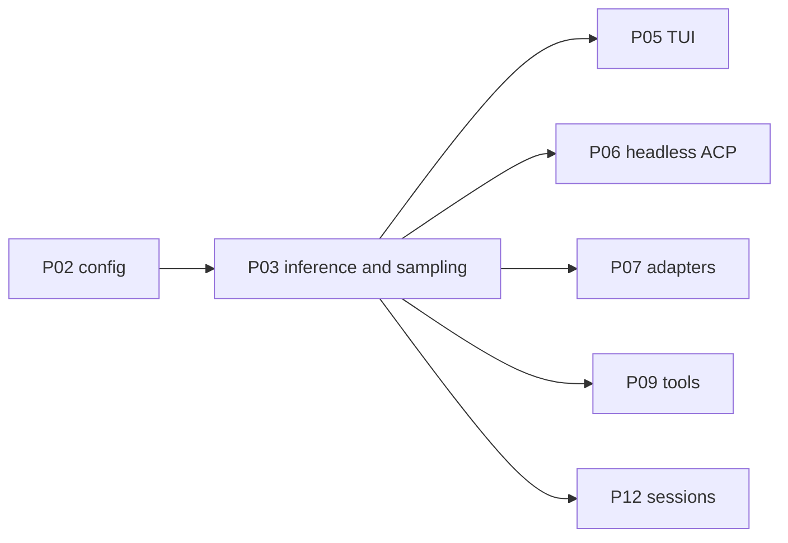

# P03 — Inference and sampling

| Field | Value |
|---|---|
| Status | done |
| Owner | — |
| Depends on | P02 |
| Unlocks | P05, P06, P07, P09, P12 |
| Primary crates | `xai-grok-sampler`, `xai-grok-sampling-types`, `xai-grok-shell` |

## Neighborhood



Full DAG: [dag.md](dag.md).

## Goal

Turns stream against the configured local runtime. Default protocol is
OpenAI Chat Completions. Timeouts and retries fit cold-loaded local
models. User-facing errors name the runtime id and URL.

## Capabilities

- One complete agent turn (prompt → model → tool loop → final text)
  against a Chat Completions server on `base_url`.
- `api_backend = chat_completions` is the fork default; `responses` and
  `messages` remain available when a runtime speaks them.
- `stream_tool_calls` is per-runtime / per-model, not a global assumption.
- Idle timeout long enough for first token after a cold load.
- No request is sent to SpaceXAI hosted inference unless an operator
  explicitly configured that URL (out of scope / not a goal).

## Non-goals

- Do not implement Ollama native `/api/chat` unless Chat Completions is
  insufficient (defer to P07).
- Do not rewrite the sampler crate's actor model.
- Do not change tool registry or ACP framing.

## Seams

| Path | Change |
|---|---|
| `xai-grok-sampler` | Client build, headers, timeouts, error strings |
| `xai-grok-shell/src/sampling/` | Re-exports; keep `Client` alias |
| `xai-grok-shell/src/agent/models/endpoint.rs` | Endpoint construction |
| Tests / fixtures | Mock `POST /v1/chat/completions` |

## Acceptance

- [x] Headless `-p` against Ollama (`GROK_LOCAL_MODEL=llama3.2:latest`)
      completed `end_turn` with `modelCalls` on that slug; no xAI credentials.
- [x] HTTP 404 ACP errors include `[model.local]`, `GROK_LOCAL_MODEL`, and
      the default `127.0.0.1:11434` URL.
- [x] Existing `stream::collect::tests::happy_path_returns_response_and_metrics`
      covers Chat Completions chunk merge.

## Risks

- Some local servers ignore or reject `stream_tool_calls` — must be
  overridable (already noted in upstream custom-models docs).
- Compaction / token estimates still assume huge hosted windows — keep
  in mind for P04 / P12.

## Notes

Landed 2026-08-12.

- `GROK_LOCAL_MODEL` overrides the baked default entry's **routing slug**
  (`info.model`). Catalog id stays `local`. `[model.local] model` wins
  over the env.
- `sampling_config_for_model` now copies `inference_idle_timeout_secs`
  (baked 600s) into the sampler.
- 404 / HTTP client ACP errors append a local-runtime hint.
- Do not auto-pick from `ollama list` (P04).

Operator:

```toml
[model.local]
model = "llama3.2:latest"
base_url = "http://127.0.0.1:11434/v1"
```

or `GROK_LOCAL_MODEL=llama3.2:latest`.
