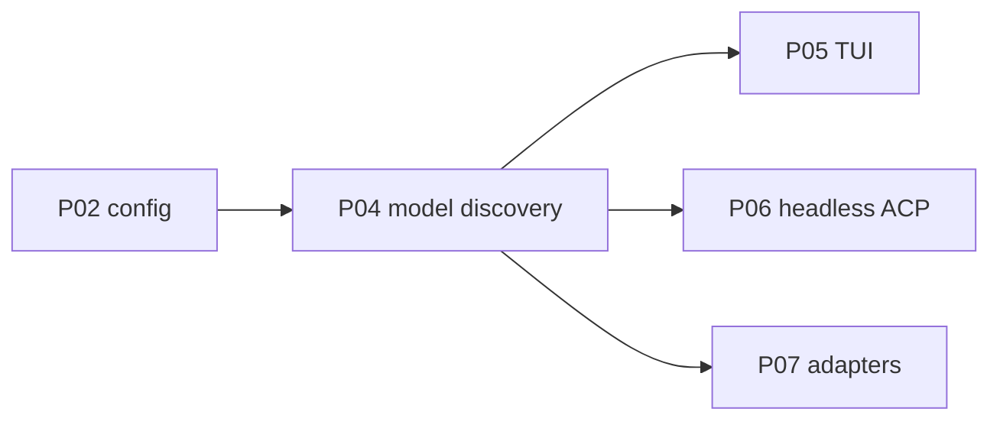

# P04 — Model discovery and catalog

| Field | Value |
|---|---|
| Status | done |
| Owner | — |
| Depends on | P02 |
| Unlocks | P05, P06, P07 |
| Primary crates | `xai-grok-shell` (`agent/models/`) |

## Neighborhood

Full DAG: [dag.md](dag.md).

## Goal

The catalog is the union of explicit `[model.*]` entries and models
discovered from each configured runtime. No grok.com remote settings
feed.

## Capabilities

- Probe `GET {base_url}/models` (OpenAI shape) per runtime.
- Merge: explicit config wins on id collision; discovered models inherit
  the runtime's backend, headers, and context-window hint.
- If probe fails, keep explicit models and surface a non-fatal warning.
- Cache is local and invalidates on config/runtime change.

## Non-goals

- Vendor-specific list endpoints (Ollama `/api/tags`) wait for P07.
- TUI picker chrome waits for P05.
- Do not prefetch a hosted SpaceXAI model list.

## Seams

| Path | Change |
|---|---|
| `xai-grok-shell/src/agent/models/fetch.rs` | Local probe instead of remote catalog |
| `xai-grok-shell/src/agent/models/cache.rs` | Cache key includes runtime URL |
| `xai-grok-shell/src/agent/models/resolution.rs` | Merge rules |
| `xai-grok-shell/src/remote/` | Must not be required for listing |

## Acceptance

- [x] Two explicit models + discovered ids merge; config wins on collision
      (`resolve_model_list_merges_discovered_and_config_wins`).
- [x] Empty/failed prefetch keeps baked `[model.*]` / `local` defaults.
- [x] `grok models` without login lists baked `local` plus Ollama slugs
      from `GET http://127.0.0.1:11434/v1/models`.

## Risks

- Some servers mount models at `/v1/models` vs `/models` depending on
  whether `base_url` already includes `/v1`. Normalize once and document.

## Notes

Landed 2026-08-12.

- Startup prefetch no longer requires grok.com login. Local/custom
  `/v1/models` is probed even when `features.remote_fetch` is off.
- List URL is always `resolve_models_list_url()` (default
  `http://127.0.0.1:11434/v1/models`). `XAI_API_KEY` does not retarget
  to `api.x.ai`.
- Auth on the list request is optional (`LOCAL_API_KEY` / `XAI_API_KEY`).
- Merge is a union: discovered ids are added; same-id baked/config
  entries win. Empty discovery does not wipe the baked catalog.
- OpenAI `{id}` entries without `context_window` get 8192 on loopback.
- Vendor `/api/tags` still P07. TUI picker chrome still P05.
