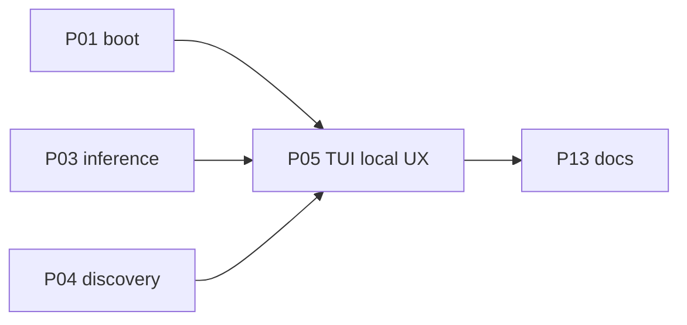

# P05 — TUI local UX

| Field | Value |
|---|---|
| Status | done |
| Owner | — |
| Depends on | P01, P03, P04 |
| Unlocks | P13 |
| Primary crates | `xai-grok-pager`, `xai-grok-pager-minimal` |

## Neighborhood

Full DAG: [dag.md](dag.md).

## Goal

The interactive UI describes **runtimes and local models**, not grok.com
login or a hosted Grok catalog. All existing TUI capabilities stay.

## Capabilities

- Welcome screen does not require or push `grok login`.
- `/models`, `/m`, and the model picker list the merged local catalog.
- `/login` is absent, hidden, or clearly a no-op / local-credential helper.
- Status / errors name runtime + model + URL.
- Full pager remains the product TUI; minimal pager stays an extra surface.

## Non-goals

- Do not replace Elm Action/Effect architecture.
- Do not rebind chords without updating user-guide 03/04.
- Do not drop mermaid, slash commands, or panes to "simplify".

## Seams

| Path | Change |
|---|---|
| pager welcome | Copy + first-run path |
| slash `/models`, `/login` | Retarget |
| model picker (`Ctrl+M` in scrollback) | Local catalog |
| `xai-grok-pager-minimal` | Same identity story if it shows auth |

## Acceptance

- [x] `needs_login` is false when `local` is first (P01); welcome fallback
      label is "local runtime", not grok.com.
- [x] `/login` is a local-runtime help message, not `Action::Login`.
- [x] `/model` still lists the merged catalog (P04). `grok models`
      banner is "Using local runtime (no hosted login)."
- [x] Headless still works (P03 + P06).

## Risks

- Welcome/onboarding still embeds grok.com URLs in assets — grep and
  replace user-visible strings only.

## Notes

Landed 2026-08-12.

- Shared `local_runtime_operator_help()` in `xai-grok-shell` config.
- Interactive TUI first paint was not exercised in a real terminal this
  session; the same `needs_login` / `AuthState::Done` path as P01 applies.
- Full pager remains the product TUI.
