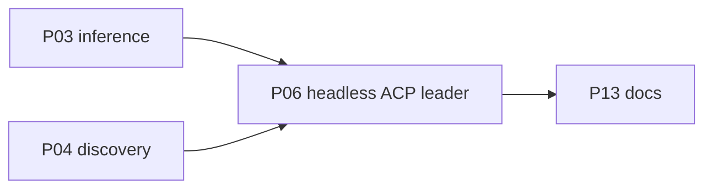

# P06 — Headless, ACP, and leader

| Field | Value |
|---|---|
| Status | done |
| Owner | — |
| Depends on | P03, P04 |
| Unlocks | P13 |
| Primary crates | `xai-grok-pager-bin`, `xai-grok-shell`, `xai-acp-lib` |

## Neighborhood

Full DAG: [dag.md](dag.md).

## Goal

Non-TUI process modes work against the same local runtime as the TUI.
ACP/stdio, headless `-p`, and leader attach remain first-class.

## Capabilities

- `grok -p "..."` completes a turn on the configured runtime.
- `grok agent stdio` (ACP) starts a session without xAI login.
- Leader spawn/attach does not require hosted identity.
- Output formats documented for headless still function.

## Non-goals

- Do not change ACP wire protocol.
- Do not drop leader to simplify local use.
- Do not implement new IDE integrations.

## Seams

| Path | Change |
|---|---|
| `pager-bin` headless / agent / leader args | Auth not required |
| `xai-grok-shell` `run_headless` / `run_stdio_agent` / `run_leader` | Use P02/P03 resolution |
| `xai-acp-lib` | Only if identity leaks onto the wire |

## Acceptance

- [x] Headless `-p` against Ollama completed in P03 (`end_turn`, no key).
- [x] Eager ACP auth selects `local` (`select_eager_auth_prefers_local_default`).
      Headless "not signed in" copy is local-runtime help, not `grok login`.
- [x] `workspace_start` no longer calls `ensure_authenticated` (no browser).

## Risks

- Client identity / version headers (`PAGER_CLIENT_VERSION`) may still
  advertise upstream names — fine; do not send them as auth.

## Notes

Landed 2026-08-12.

Full ACP stdio initialize handshake was not driven from a third-party
client this session; the same `local` auth method is what initialize
advertises. `grok login` CLI remains as an unused optional command.
