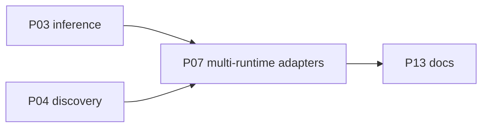

# P07 — Multi-runtime adapters

| Field | Value |
|---|---|
| Status | done |
| Owner | — |
| Depends on | P03, P04 |
| Unlocks | P13 |
| Primary crates | `xai-grok-shell` (`models/`, `model_providers`), `xai-grok-sampler` |

## Neighborhood

Full DAG: [dag.md](dag.md).

## Goal

Named adapters for common local servers so operators are not debugging
OpenAI-shape mismatches by hand. Extend, do not replace, the generic
Chat Completions path from P03.

## Capabilities

Per runtime, document and implement as needed:

| Runtime | Probe | Default backend | Notes |
|---|---|---|---|
| Generic OpenAI-compat | `GET /v1/models` | `chat_completions` | Baseline (P03/P04) |
| Ollama | `/v1/models` or `/api/tags` | `chat_completions` | Cold start; keys often unused |
| llama.cpp / llama-server | `/v1/models` | `chat_completions` | Tool-call variance |
| vLLM | `/v1/models` | `chat_completions` | May speak Responses |
| LM Studio | `/v1/models` | `chat_completions` | Local key sometimes required |
| LocalAI | `/v1/models` | `chat_completions` | |
| MLX / other | probe or explicit only | `chat_completions` | |
| Anthropic-compat proxy | optional | `messages` | Local/LAN only |

Each adapter: probe, `api_backend`, tool-call support, context-window
source, idle timeout hint, fixture test.

## Non-goals

- Cloud BYOK (OpenAI/Anthropic hosted) is not a product goal.
- Do not add a new workspace crate until probing outgrows `models/`.

## Seams

| Path | Change |
|---|---|
| `model_providers` | Optional `kind` / adapter id |
| `agent/models/fetch.rs` | Adapter-specific list URLs |
| sampler client build | Header and `stream_tool_calls` presets |
| fixtures | `ollama_list_models.json`, etc. |

## Acceptance

- [x] At least generic + one real adapter (Ollama) has config presets +
      unit tests (`kind = "ollama"` fills unset `base_url` + `chat_completions`).
- [x] Adapter checklist in `AGENTS.md` is followed for each added server
      (thin slice: kind presets only; live `/api/tags` still deferred).
- [x] A runtime that cannot emit tools can run text-only without crashing
      the tool loop (P03 already landed; adapters do not change that).

## Risks

- Over-fitting adapters too early — land generic path first (P03/P04).

## Notes

Thin slice landed: optional `[model_providers.<id>].kind`. `ollama` fills
unset `base_url` (`http://127.0.0.1:11434/v1`) and `api_backend =
chat_completions`. `generic` / `openai-compat` are no-ops. llama.cpp /
vLLM / LM Studio / LocalAI / MLX only default `api_backend` when unset.
Unknown `kind` warns and stays generic. Explicit URLs always win.
Port-probe auto-detect remains deferred (config vs detect decision).
