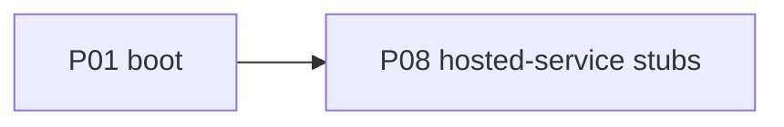

# P08 — Hosted-service stubs

| Field | Value |
|---|---|
| Status | done |
| Owner | — |
| Depends on | P01 |
| Unlocks | — (hygiene; not on the inference critical path) |
| Primary crates | `xai-mixpanel`, `xai-grok-telemetry`, `xai-grok-update`, `xai-grok-announcements`, shell `remote/`, `relay/` |

## Neighborhood

No downstream phase. Parallel hygiene after P01. Full DAG: [dag.md](dag.md).

## Goal

Hosted SpaceXAI services are never a required path. Gate or stub at call
sites. Keep crates in the workspace if removal would blow up the graph.

## Capabilities

- Mixpanel / telemetry: no-op or local-only; process runs offline.
- Auto-update from xAI: off by default; no forced exit.
- Announcements / dashboard / paid usage: hidden or "unavailable locally".
- Remote conversation sync / grok.com pull: disabled.
- Image/video **model routing** that assumed xAI: clear error (tools stay: P09).

## Non-goals

- Do not delete Mixpanel, telemetry, update, announcements, or remote
  crates in this phase.
- Do not implement an alternative analytics backend.

## Seams

| Path | Change |
|---|---|
| `xai-mixpanel` call sites | Gate |
| `xai-grok-update` | Already no-op from P01; confirm remaining callers |
| `xai-grok-announcements` | Skip fetch |
| `xai-grok-shell/src/remote/` | Offline by default |
| `xai-grok-shell/src/relay/` | Offline by default |
| pager dashboard / usage views | Local empty/error state |

## Acceptance

- [x] `features.remote_fetch` defaults **off**. Hosted settings / grok.com
      catalog are not fetched unless config opts in. Local `/v1/models`
      still probes (P04).
- [x] Mixpanel default `mixpanel_enabled = false`; empty-token `track` is
      a no-op. Auto-update already off (P01). Relay already opt-in.
- [x] Sentry/error reporting defaults off (`is_error_reporting_disabled_sync`).
- [x] Crates kept. Targeted tests passed.

## Risks

- Stubbing the wrong layer can hide real sampler failures — never stub
  inference errors.

## Notes

Landed 2026-08-12.

Leftovers (not blocked for local use):

- Image/video tool routing that assumed xAI (P09).
- Announcements poll still *exists* but skips without grok.com auth.
- If `~/.grok/auth.json` still has a hosted session, some code paths may
  try grok.com; a clean `GROK_HOME` does not. Hosted `x.ai/billing` /
  auto-topup are skipped when `features.remote_fetch` is off (default) or
  the current model `base_url` is loopback, so leftover grok.com login
  cannot paint "Weekly limit left: …" on a local runtime.
- Packet capture of a full TUI boot was not run; defaults are the gate.
