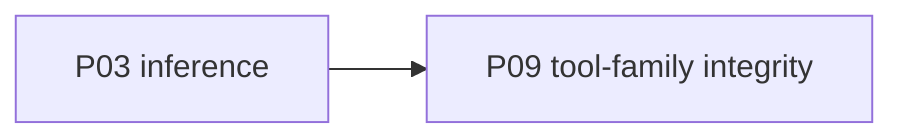

# P09 — Tool-family integrity

| Field | Value |
|---|---|
| Status | done |
| Owner | — |
| Depends on | P03 |
| Unlocks | — (keep/extend; further tool work appends here) |
| Primary crates | `xai-grok-tools`, `xai-grok-tools-api`, `crates/common/xai-tool-*` |

## Neighborhood

No downstream phase. Full DAG: [dag.md](dag.md).

## Goal

All three implementation families keep working against a local model
turn. Do not delete tools to slim the tree. Extend later in this same
phase (or a child EDD), never by dropping Codex/OpenCode ports.

## Capabilities

- `grok_build`: bash, read/edit, grep, list_dir, web, tasks, scheduler,
  plan mode, LSP, workflow, todos, image/video (error if no backend).
- `codex`: apply_patch, grep, list_dir, read_file.
- `opencode`: bash, edit, glob, grep, read, write, skill, todowrite.
- MCP `use_tool` still dispatches (full MCP servers: P11).
- Tools that need a hosted model (image/video/web synthesis) return a
  named "runtime does not provide this" error.

## Non-goals

- Do not merge the three families into one.
- Do not change tool JSON schemas unless a local-model incompatibility
  forces it (document in notes).

## Seams

| Path | Change |
|---|---|
| `xai-grok-tools/src/implementations/grok_build/` | Hosted-backend errors |
| `.../codex/`, `.../opencode/` | Compile + smoke on a local turn |
| image/video/web_search clients | No implicit xAI key |

## Acceptance

- [x] Targeted tests: `prepare_image_gen_*` (3) and hosted-unavailable copy.
- [x] Local turns already used read/edit/grep/list/bash in P03 (tool loop).
- [x] Image/video/web_search stay registered; missing Imagine/xAI backend
      returns `HOSTED_CAPABILITY_UNAVAILABLE`. Local dummy keys are not
      sent to `api.x.ai`. `web_fetch` is unchanged.

## Risks

- Web search / fetch may still be useful locally — do not stub fetch if
  the machine has network; only drop the xAI-keyed search client default.

## Notes

Landed 2026-08-12.

- `prepare_image_gen` / `prepare_video_gen` stay `Disabled` when the
  session `base_url` is loopback (or unparseable).
- `web_search` is not Enabled against a local inference URL.
- Codex/OpenCode ports untouched.
- Full `cargo test -p xai-grok-tools` was not run (large suite).
