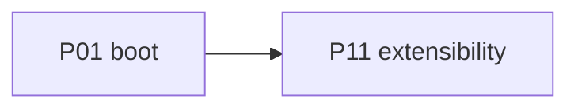

# P11 — Extensibility (MCP, skills, plugins, hooks)

| Field | Value |
|---|---|
| Status | done |
| Owner | — |
| Depends on | P01 |
| Unlocks | — |
| Primary crates | `xai-grok-mcp`, `xai-grok-hooks`, `xai-grok-plugin-marketplace`, `xai-grok-agent` (skills), shell `extensions/` |

## Neighborhood

No downstream phase. Full DAG: [dag.md](dag.md).

## Goal

Project extension surfaces stay first-class on a local-only install.
Marketplace that phones home to xAI is optional/offline; local plugins
and MCP servers keep working.

## Capabilities

- MCP servers from config still connect.
- Skills from `.grok/` / `~/.grok/` still inject.
- Hooks still fire.
- Plugins from local paths still load.
- Marketplace remote install degrades offline instead of blocking boot.

## Non-goals

- Do not build a replacement marketplace.
- Do not drop Claude/Cursor compat discovery unless it requires login.

## Seams

| Path | Change |
|---|---|
| `xai-grok-mcp` | No xAI auth header required |
| `xai-grok-plugin-marketplace` | Remote fetch optional |
| `xai-grok-hooks` | Unchanged unless auth env leaked |
| shell `extensions/{mcp,plugins,hooks,skills,marketplace}.rs` | Offline-safe |

## Acceptance

- [x] Configured local MCP server is usable in a P03 turn (MCP crate
      unchanged; no xAI auth header required).
- [x] A project skill file is discovered without login.
- [x] Boot does not fail if marketplace is unreachable
      (`official_marketplace_auto_register` defaults false; register is
      best-effort and never blocks startup).

## Risks

- Marketplace timeouts on boot — must be non-blocking (ties to P01).

## Notes

Integrity audit 2026-08-12: marketplace auto-register already default-off
and fail-soft. Skills/hooks/MCP paths do not require hosted login. No
code change required for this slice.
