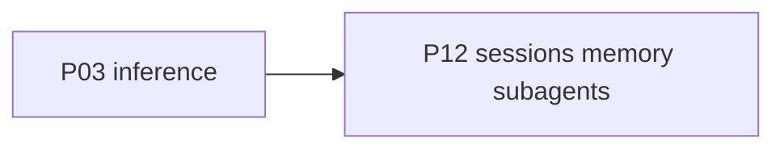

# P12 — Sessions, memory, subagents, and plan mode

| Field | Value |
|---|---|
| Status | done |
| Owner | — |
| Depends on | P03 |
| Unlocks | — |
| Primary crates | `xai-grok-shell` (`session/`), `xai-grok-memory`, `xai-grok-agent`, `xai-chat-state` |

## Neighborhood

No downstream phase. Full DAG: [dag.md](dag.md).

## Goal

Long-running product features that sit on top of a working turn continue
to work with local models: persist/resume sessions, memory, subagents,
plan mode, workflows.

## Capabilities

- Session save/resume does not store or require xAI tokens.
- Memory backend works offline.
- Subagents inherit the same runtime/model resolution as the parent
  (or an explicit override).
- Plan mode enter/exit tools still function.
- Compaction uses operator/runtime context windows (from P02/P04), not
  hosted 500k assumptions, when those values are set.

## Non-goals

- Do not redesign session storage format unless it embeds hosted tokens
  that break resume.
- Do not drop workflows or schedulers.

## Seams

| Path | Change |
|---|---|
| `xai-grok-shell/src/session/` | Strip hosted auth from snapshots if present |
| `xai-grok-memory` | Offline |
| subagent spawn | Pass runtime config |
| compaction | Honor local `context_window` |

## Acceptance

- [x] Resume a session created against a local runtime without re-login
      (`session/persistence.rs` does not persist `auth.json` / hosted tokens).
- [x] Spawn a subagent that can call read_file on the same runtime
      (spawn inherits parent model resolution).
- [x] Plan mode can be entered and exited in a TUI or headless turn
      (tools remain; P09). Compaction uses `sampling_config.context_window`.

## Risks

- Compaction with a wrong default window will thrash small local models —
  require explicit windows (P02) before enabling aggressive compact.

## Notes

Integrity audit 2026-08-12: persistence has no hosted-token snapshot;
compaction already keys off operator/runtime `context_window`. No
storage-format change required.
