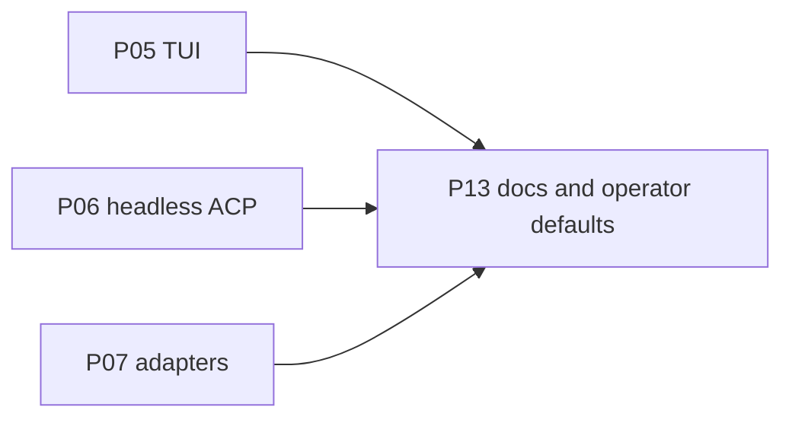

# P13 — Docs and operator defaults

| Field | Value |
|---|---|
| Status | done |
| Owner | — |
| Depends on | P05, P06, P07 |
| Unlocks | — |
| Primary crates | pager `docs/user-guide/`, root README |

## Neighborhood

Sink node. Full DAG: [dag.md](dag.md).

## Goal

Operator-facing docs match the fork: local runtimes, no grok.com login,
how to point at Ollama/llama.cpp/vLLM. README install/auth sections
retargeted. Phase statuses and memory updated.

## Capabilities

- User-guide 02 (auth), 11 (custom models), 14 (headless), 15 (agent
  mode) describe local-first flows.
- Example `config.toml` for at least one local runtime lives in docs.
- Root README does not send people to `x.ai/cli` as the only path.
- `AGENTS.md` / `MEMORY.grok.md` / `phases/README.md` statuses are
  current.

## Non-goals

- Do not rewrite the entire user guide.
- Do not claim Windows support the upstream tree does not test.

## Seams

| Path | Change |
|---|---|
| `crates/codegen/xai-grok-pager/docs/user-guide/02-authentication.md` | Local-first |
| `.../11-custom-models.md` | Runtimes |
| `README.md` | Fork identity |
| `AGENTS.md`, `MEMORY.grok.md`, `phases/` | Status sync |

## Acceptance

- [x] A new operator can configure a local server from docs alone
      (`AGENTS.md` example + user-guide 11).
- [x] No user-guide page still says hosted `grok-4.5` is the default
      without a fork callout (11 + guide README).
- [x] Phase table in `phases/README.md` reflects reality.

## Risks

- Docs-only drift if this phase starts before P05–P07 exist — wait for
  those, then write what shipped.

## Notes

Last on the product-facing path. Internal EDDs (this directory) stay
the source of truth for implementers.
