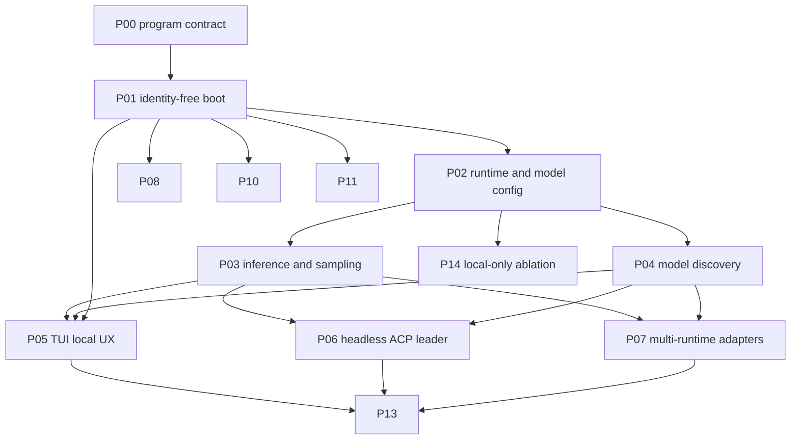

# P14: Local-Only Ablation

## Summary

Convert the local-first fork to a pure local-only build by removing all xAI cloud dependencies. This eliminates the need for authentication, updates, telemetry, and remote services, making the tool work seamlessly with local models out of the box.

## Status

- **ID**: P14
- **Status**: complete
- **Depends on**: P00, P01, P02, P03, P04, P05, P06, P07

## Motivation

The local-first fork should be a **pure local tool**. Users should be able to:
- Run `grok` without any login
- Use the model picker without configuration
- Have no network dependencies
- Not collide with the official Grok Build TUI Harness

Currently, the codebase still contains:
- Auto-update from xAI servers
- Telemetry/Mixpanel calls
- OIDC/device code authentication flows
- Managed configuration (`grok setup`)
- Remote model discovery
- Relay session sync

## Implementation Plan

### Phase 1: Core Removal

#### 1. Remove Update System
- Remove `xai-grok-update` crate from workspace
- Remove `run_update_command` and related functions from `main.rs`
- Remove `Command::Update` handling
- Remove version policy enforcement

#### 2. Remove Telemetry
- Remove `xai-grok-telemetry` integration from `main.rs`
- Keep minimal `tracing` for debugging
- Remove OTEL external/internal layer setup

#### 3. Remove Managed Config
- Remove `run_setup_command` function
- Remove `Command::Setup` handling
- Replace with local instructions for configuring models

### Phase 2: Auth Simplification

#### 4. Remove OIDC/Auth Flows
- Remove `auth/oidc/` directory contents
- Remove `auth/device_code.rs`
- Keep `AuthMode::ApiKey` and `auth/api_key_probe.rs`
- Keep `auth/provider.rs` for external auth support

#### 5. Simplify Auth Prompts
- Update welcome screen to show local instructions
- Remove "run `grok login`" suggestions for local models

### Phase 3: Remote Service Removal

#### 6. Remove Remote Model Fetching
- In `models/fetch.rs`, make `prefetch_models_blocking` return None
- Keep baked defaults from `default_models.json`
- Keep user config from `config.toml`

#### 7. Remove Relay Sync
- Remove `relay/` module or stub all functions
- Remove `Command::Leader` handling (or keep local leader mode)
- Remove workspace commands that require remote settings

### Phase 4: Cleanup and UX

#### 8. Remove Workspace Remote Features
- Remove `run_workspace_mgmt` that requires remote settings
- Keep local workspace commands (start/stop local leader)

#### 9. Update Documentation
- Update user guide for local-only experience
- Document model configuration for local runtimes
- Remove references to `grok login` and xAI services

#### 10. Build and Verify
- Verify compilation without removed crates
- Test local model configuration works
- Verify model picker shows local models

## Code Changes by Area

### crates/codegen/xai-grok-pager-bin/src/main.rs
- Remove `xai_grok_update` import and usage
- Remove `run_setup_command` function
- Remove `Command::Update` and `Command::Setup` handling
- Remove `run_workspace_mgmt` or simplify to local-only
- Remove telemetry initialization
- Keep TUI, headless, leader, stdio modes

### crates/codegen/xai-grok-shell/src/auth/
- Remove `oidc/` directory
- Remove `device_code.rs`
- Keep `model.rs`, `provider.rs`, `api_key_probe.rs`
- Keep `AuthMode::ApiKey` support

### crates/codegen/xai-grok-shell/src/agent/models/
- Modify `fetch.rs` to skip remote fetching
- Keep `detect.rs` for runtime probing
- Keep `resolution.rs` for model resolution

### crates/codegen/xai-grok-shell/src/relay/
- Stub or remove all sync functions
- Keep relay types for potential future use

### crates/codegen/xai-grok-update/
- Remove entire crate

### crates/codegen/xai-grok-telemetry/
- Remove from main binary, keep as library for optional use

## Success Criteria

1. Binary builds without xai-grok-update or telemetry crates
2. No network calls required for basic operation
3. Model picker shows local models without config
4. TUI works without any authentication
5. `-p` headless mode works with local model
6. Workspace commands work locally

## Neighborhood

