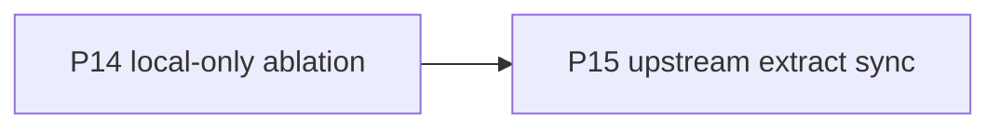

# P15 — Upstream extract sync

| Field | Value |
|---|---|
| Status | done |
| Owner | — |
| Depends on | P14 |
| Unlocks | future extract syncs |
| Primary crates | `xai-grok-pager-bin`, `xai-grok-shell`, `xai-grok-models` |

## Neighborhood

## Goal

Record a new extract sync point and merge `upstream/main` (`19d42e3`,
`SOURCE_REV` `7d67deacbeb1c1093fdb4f9bcbfab2630e18a6aa`) while keeping the
local-first envelope: no required login, baked `local` catalog, loopback
inference default, stubbed update/telemetry at the binary.

## Capabilities

- Fork tracks official extract SHA in `SOURCE_REV` after this merge.
- Product crates from the extract compile; TUI/headless/ACP surfaces remain.
- Operator still uses `[model.*]` + local runtimes as `/model`.

## Non-goals

- Rebase of published fork history.
- Restoring grok-4.6 / Responses as baked defaults.
- Relinking live `xai-grok-update` / Mixpanel into the pager binary.
- GROK_HOME isolation.

## Seams

| Path | Change |
|---|---|
| `SOURCE_REV` | `7d67deacbeb1c1093fdb4f9bcbfab2630e18a6aa` |
| `default_models.json` | Keep fork `local` catalog |
| `pager-bin/src/main.rs` | Upstream config loader + `memory_enabled_override`; keep stubs |
| `shell/.../agent/config.rs` | Upstream APIs + local URL/window/env slug |
| `shell/.../remote/client.rs` | Optional local API key list; no `api.x.ai` default list |

## Acceptance

- [x] `cargo check -p xai-grok-pager-bin`
- [x] `cargo test -p xai-grok-pager-bin` (39 unit + update test; TUI not exercised)
- [x] `cargo test -p xai-grok-shell --lib models_fetch_endpoint_matches_auth_mode`
- [x] `cargo test -p xai-grok-config` — 215 passed; `effective_config_honors_dismiss` failed (likely host `~/.grok` campaign state; not introduced by the envelope)
- [x] Baked default is `local`, not `grok-4.6`
- [x] `should_check_for_updates` remains `false`
