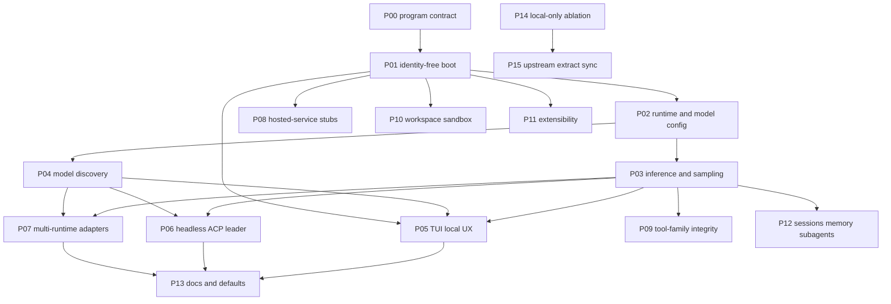

# Phase EDDs

Engineering design documents for the local-first Grok Build fork. Each file
is one **capability bundle** with explicit **depends-on / unlocks** edges.
Implement in dependency order. Do not start a phase whose blockers are still
`planned` unless the EDD says it can run in parallel.

Status values: `planned` · `in_progress` · `blocked` · `done`

| ID | Phase | Status | Depends on |
|---|---|---|---|
| [P00](P00-program-contract.md) | Program contract | done | — |
| [P01](P01-identity-free-boot.md) | Identity-free boot | done | P00 |
| [P02](P02-runtime-and-model-config.md) | Runtime and model config | done | P01 |
| [P03](P03-inference-and-sampling.md) | Inference and sampling | done | P02 |
| [P04](P04-model-discovery.md) | Model discovery and catalog | done | P02 |
| [P05](P05-tui-local-ux.md) | TUI local UX | done | P01, P03, P04 |
| [P06](P06-headless-acp-leader.md) | Headless, ACP, leader | done | P03, P04 |
| [P07](P07-multi-runtime-adapters.md) | Multi-runtime adapters | done | P03, P04 |
| [P08](P08-hosted-service-stubs.md) | Hosted-service stubs | done | P01 |
| [P09](P09-tool-family-integrity.md) | Tool-family integrity | done | P03 |
| [P10](P10-workspace-sandbox-worktrees.md) | Workspace, sandbox, worktrees | done | P01 |
| [P11](P11-extensibility.md) | Extensibility (MCP, skills, plugins, hooks) | done | P01 |
| [P12](P12-sessions-memory-subagents.md) | Sessions, memory, subagents, plan mode | done | P03 |
| [P13](P13-docs-and-operator-defaults.md) | Docs and operator defaults | done | P05, P06, P07 |
| [P14](P14-local-only-ablation.md) | Local-only ablation | done | P02 |
| [P15](P15-upstream-extract-sync.md) | Upstream extract sync | done | P14 |

**Critical path:** P01 → P02 → P03 → P05 / P06.

**Parallel after P01:** P08, P10, P11 (integrity / stub work; do not block inference).

**Parallel after P02:** P03 and P04.

More views (critical path, join after P03∥P04, parallel tracks, capability
lanes): [`dag.md`](dag.md). Each EDD has a neighborhood Mermaid of its own
edges only. Prefer Mermaid in these Markdown files over a Graphviz `.dot`.

New phases copy [`_template.md`](_template.md). Update this table, the graph
here **and** in `dag.md`, the two neighborhood diagrams, `AGENTS.md`, and
`MEMORY.grok.md` when a phase is added or its status changes.
