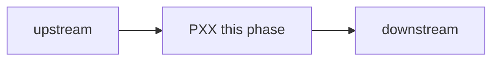

# PXX — Title

| Field | Value |
|---|---|
| Status | planned |
| Owner | — |
| Depends on | |
| Unlocks | |
| Primary crates | |

## Neighborhood

Incoming (depends on) and outgoing (unlocks) only. Full DAG: [dag.md](dag.md).

## Goal

One paragraph: what capability this phase delivers and why it exists.

## Capabilities

- Capability the operator or agent can use when this phase is `done`.

## Non-goals

- What this phase must not do (no product cuts, no extra rewrites).

## Seams

| Path | Change |
|---|---|

## Acceptance

- [ ] Observable check an implementer can run.

## Risks

- Risk and the mitigation.

## Notes

Working notes. Append; do not rewrite history.
