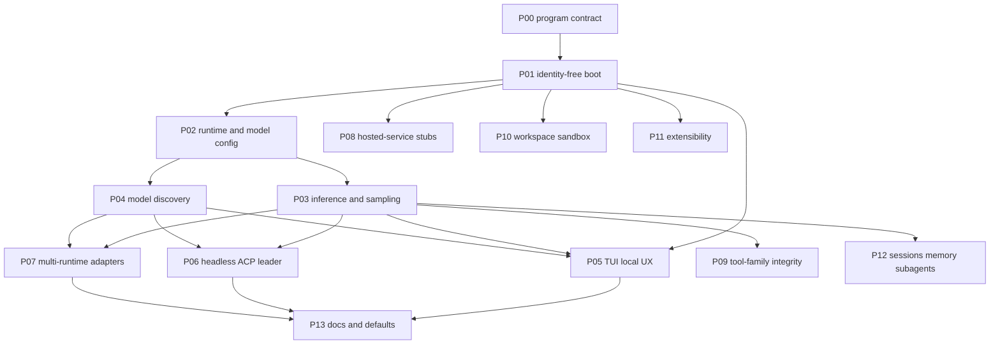
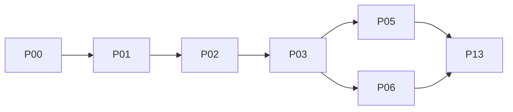
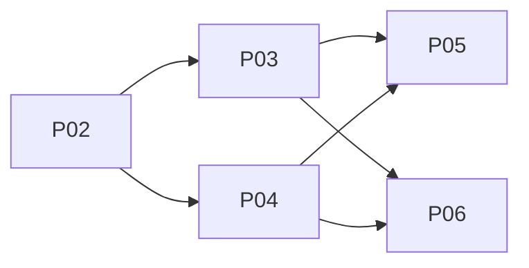
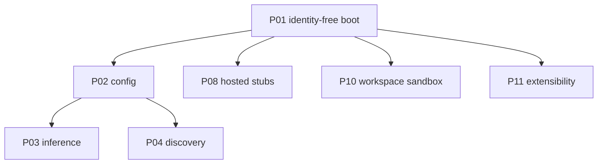
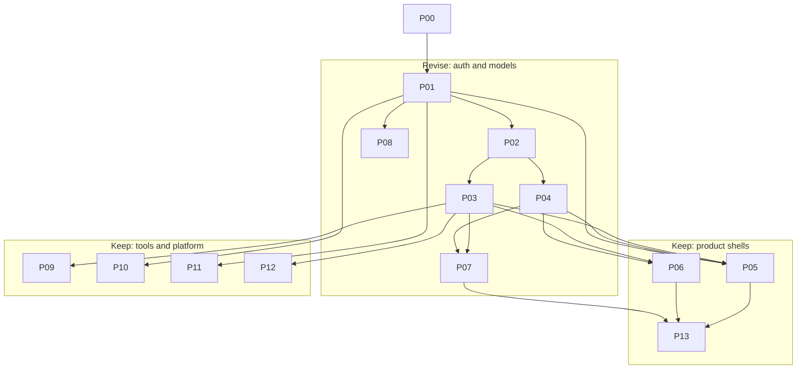

# Phase DAG (Mermaid)

Canonical **multi-view** graphs. The same edges live in [`README.md`](README.md).
Each EDD has a **neighborhood** diagram (incoming + outgoing only). Do not
add a Graphviz `.dot` unless we need generated images or a CI check; Mermaid
is what GitHub, the pager, and most editors already render from this tree.

When you add an edge, update: this file, `README.md`, the two EDD
neighborhoods, `AGENTS.md`, and `MEMORY.grok.md`.

## Full dependency graph

## Critical path

First local turn (TUI or headless) is unblocked when P03 is done; P05/P06
are the product-facing ends of the path.

P04 is **not** on this path but is required before P05/P06 can list models.
Treat P03 ∥ P04 after P02, then join.

## Parallel tracks after P01

Inference is not blocked by stubs or host/extensibility integrity.

## Capability lanes

Same DAG, grouped by what we are protecting vs revising.

## Why not Graphviz

| | Mermaid in Markdown | Graphviz `.dot` |
|---|---|---|
| Renders in GitHub / pager / most previewers | Yes | Needs `dot` or a generated SVG |
| Lives next to the EDD that owns the edges | Yes | Second source of truth |
| Good for 14-node DAGs | Yes | Better for huge generated graphs |
| CI can check structure | Possible later | Easier to parse |

Use Graphviz only if we start **generating** the graph from front matter
and want a checked-in SVG. Until then, one Mermaid DAG, many views.
